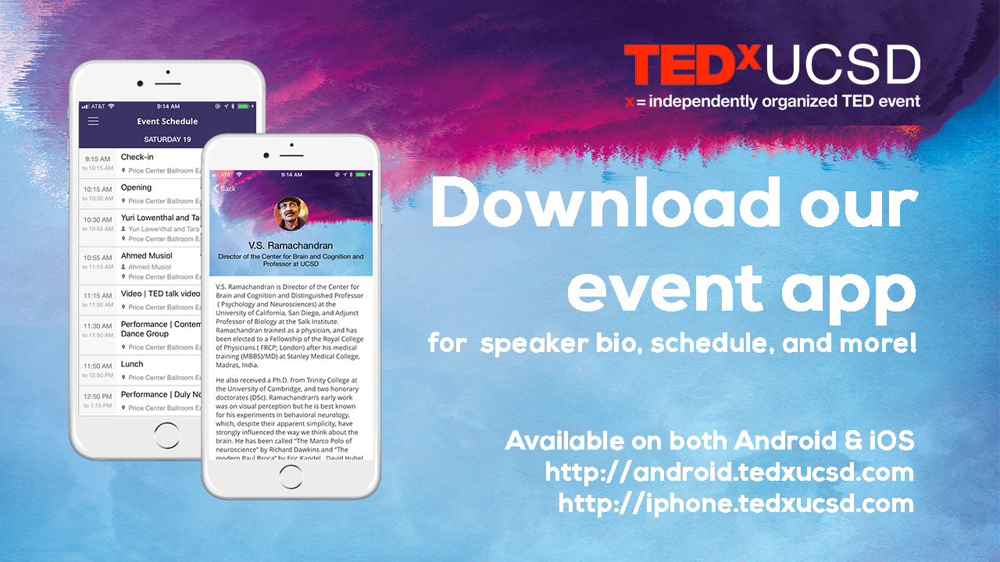

# TEDxUCSD 2018 Annual Event Andriod App
This is the Andriod App for the TEDxUCSD 2018 Annual Event. The app is built with connfa and supports speaker info lookup, event notification update, event progress, and updating/pulling speaker info from remote DB.  

 

Documentation is available on [http://connfa.com/](http://connfa.com/) 

Project is supported by [Lemberg Solutions](http://lemberg.co.uk)
